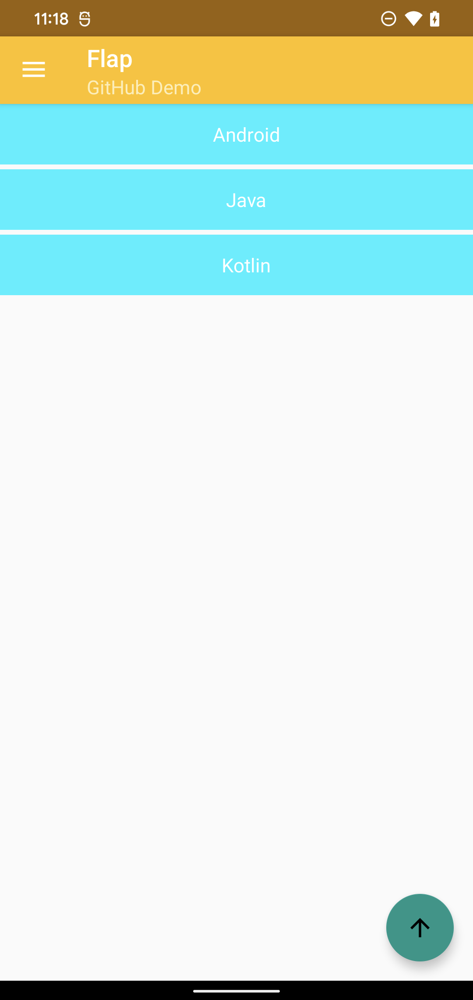

# Flap(灵动)

[](https://travis-ci.org/AlanCheen/Flap)    [](./LICENSE) [](https://github.com/AlanCheen) [](https://github.com/AlanCheen/Flap/pulls)

------


`Flap` 是一个基于 `RecyclerView` 的页面组件化解决方案，提供更好的开发体验和更强大的功能，让你更关注业务，帮你提高开发效率。

在语雀写了体验更好的文档，可以前往语雀查看。

> - [Flap 接入文档](https://www.yuque.com/cxyfy/blog/ghsc4b)；
> - [Flap 更新日志](https://www.yuque.com/cxyfy/blog/ehnxdy)；
> - [Flap 设计理念](https://www.yuque.com/cxyfy/blog/ehnxdy)；


<a name="E94H7"></a>
## Flap 使用示例：
定义一个模型类， SimpleTextModel ：
```kotlin
data class SimpleTextModel(val content: String)
```
定义 SimpleTextComponent，继承 Component ，按需重写 `onBind` 方法：
```kotlin
@Delegate(layoutName = "flap_item_simple_text")
class SimpleTextComponent(itemView: View) : Component<SimpleTextModel>(itemView) {

    private val tvContent: TextView = findViewById(R.id.tv_content)

    //参数更多 全面
    override fun onBind(model: SimpleTextModel, position: Int, payloads: List<Any>, adapter: FlapAdapter, delegate: AdapterDelegate<*, *>) {
        FLogger.d(TAG, "onBind() called with: model = $model, position = $position, payloads = $payloads, adapter = $adapter")
        tvContent.text = model.content
    }

    //参数更少的 onBind
    override fun onBind(model: SimpleTextModel) {
        FLogger.d(TAG, "onBind() called with: model = $model")
    }

    companion object {
        private const val TAG = "SimpleTextItem"
    }
}
```

使用 FlapAdapter：

```kotlin
//创建你的 FlapAdapter
var adapter: FlapAdapter = FlapAdapter()

//注册 AdapterDelegate
adapter.registerAdapterDelegate(SimpleTextComponentAdapterDelegate())

val dataList = ArrayList<Any>()
dataList.add(SimpleTextModel("Android"))
dataList.add(SimpleTextModel("Java"))
dataList.add(SimpleTextModel("Kotlin"))

//设置你的 data
adapter.setData(dataList);

recyclerView.adapter = adapter
```

这样就完全 OK 啦！ 咱们跑起来看看：

<div align=center></div>

<a name="fD7Zc"></a>
## 进阶使用
更多功能查看这个[文档](https://www.yuque.com/cxyfy/blog/ghsc4b)。
<a name="bb966aa6"></a>
## 贡献

- 发现 `Flap` 有 Bug？提 [issue](https://github.com/AlanCheen/Flap/issues) 告诉我！
- 发现 `Flap` 超好用？**star 一波，安利给所有的小伙伴！**
- 发现有需要的功能 `Flap` 不具有？ 提 [issue](https://github.com/AlanCheen/Flap/issues) 告诉我！
- 任何意见和建议都可以提喔~
<a name="2c795971"></a>
## 贡献者列表
感谢以下人员对 `Flap` 提供的帮助：

- [dreamkong](https://github.com/dreamkong)
- [Fitz](https://github.com/finalrose7)
- [Halouyao](https://github.com/doooyao)
- [码小猪](https://www.hchstudio.cn/)
- [大脑好饿](http://www.imliujun.com/)
- [zhousysu](https://github.com/zhousysu)
- [阿呆](http://blogyudan.online/)

<a name="License"></a>
## License
Apache 2.0